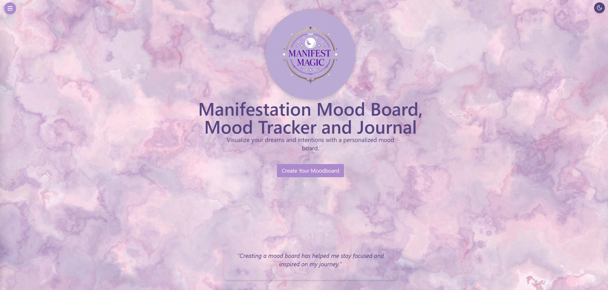
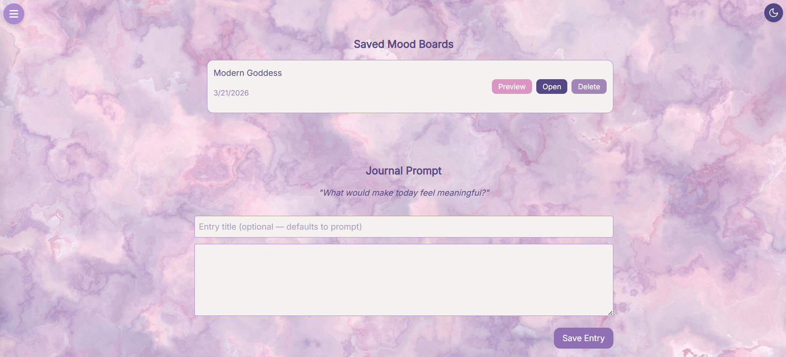
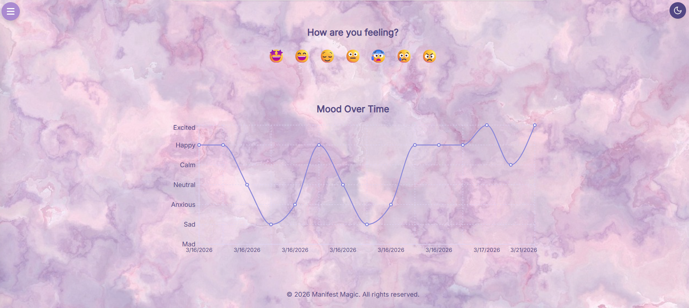
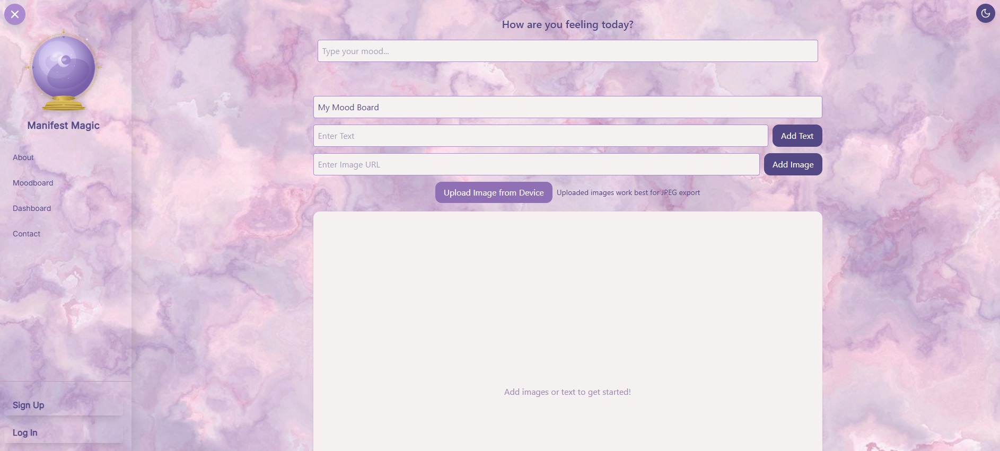
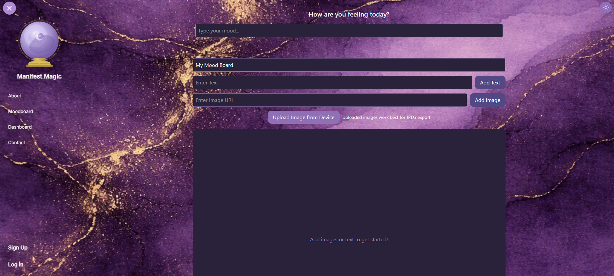

# Manifest Magic ✨

A full-stack manifestation and wellness application built with React, TypeScript, Supabase, and Node.js. Manifest Magic combines mood tracking, journaling, and a dynamic vision board into one sacred space for intentional living and personal growth.

---

## 🌙 Live Demo
Coming soon

---

## 📸 Screenshots

### Home Page


### Dashboard



### Mood Board


### Dark Mode


---

## ✨ Features

### Vision Board
- Create a personalized mood board by adding images via URL or uploading directly from your device
- Drag, resize, and arrange images and text freely on the canvas
- Layer items with Bring to Front / Send to Back controls
- Save boards to your account with a mood subtitle and reload them for editing anytime
- Scale-to-fit preview on all screen sizes including mobile
- Download your board as a JPEG using the native Canvas API
- Saved boards include a full-size preview modal with download, edit and delete options

### Mood Tracker
- Log your daily mood from 7 emotional states with emoji indicators
- Mood labels shown below each emoji for easy mobile use
- Visualize your mood patterns over time with an interactive line graph
- Track emotional trends to better understand yourself

### Journal
- Receive a daily writing prompt from a curated pool of 30 reflection prompts
- Request a new prompt without repeating the previous one
- Save journal entries to your account with optional custom titles
- Preview, edit, and delete past entries from your journal history
- Full entry preview modal with inline editing support

### User Profiles
- Choose from 12 spiritual and nature themed emoji avatars
- Set a custom display name shown in the sidebar navbar
- Avatar and display name persist across sessions and update immediately
- Change your password securely via Supabase Auth

### Authentication
- Secure signup and login with Supabase Auth
- Protected routes for Dashboard and Profile pages
- User profiles auto-created on signup via database trigger
- Persistent session across page refreshes

### UI/UX
- Light and dark mode toggle with smooth transitions
- Full screen overlay sidebar on mobile, fixed sidebar on desktop
- Transparent navbar with theme-aware text and buttons
- Scale-to-fit mood board canvas — shrinks proportionally on mobile like Pinterest
- Color scheme rooted in soft purples, lavender, rose and gold
- Custom crystal ball logo matching the app's spiritual aesthetic
- Responsive layout tested across iPhone SE, iPhone 12 Pro, Samsung Galaxy S8+, iPad Mini and Surface Duo

### Contact
- Contact form powered by Nodemailer via Gmail App Password
- Theme-aware success and error messages

---

## 🛠️ Tech Stack

**Frontend:**
- React 19 + TypeScript
- Vite
- Tailwind CSS v4
- Recharts (mood graph)
- React Router DOM
- Framer Motion (animations)
- react-rnd (drag and resize)
- Supabase JS client

**Backend:**
- Node.js + Express
- Nodemailer (contact form via Gmail)
- Image proxy server for CORS-safe external image loading

**Database & Storage:**
- Supabase (PostgreSQL)
- Row Level Security policies on all tables
- Supabase Storage for mood board image uploads

---

## 🗄️ Database Schema
```sql
profiles        -- Auto-created on signup, stores display_name, avatar_id, email
mood_logs       -- Mood entries per user with timestamps
journals        -- Journal entries with title and content per user
moodboards      -- Saved board metadata including name, mood subtitle, board dimensions
moodboard_items -- Individual items on each board with position, size and z-index
```

**Required SQL migrations:**
```sql
alter table profiles add column if not exists display_name text default '';
alter table profiles add column if not exists avatar_id integer default null;
alter table moodboards add column if not exists mood text default '';
alter table moodboards add column if not exists board_width integer default 0;
alter table moodboards add column if not exists board_height integer default 0;
alter table moodboard_items add column if not exists "zIndex" integer default 1;
```

---

## 🚀 Getting Started

### Prerequisites
- Node.js v18+
- A Supabase account and project
- A Gmail account with App Password enabled

### Installation

1. Clone the repository:
```bash
git clone https://github.com/jackietng/Manifest-Magic.git
cd Manifest-Magic
```

2. Install client dependencies:
```bash
cd client && npm install
```

3. Install server dependencies:
```bash
cd ../server && npm install
```

4. Set up your environment variables:

**`client/.env`:**
```
VITE_SUPABASE_URL=your_supabase_url
VITE_SUPABASE_ANON_KEY=your_supabase_anon_key
VITE_PROXY_URL=http://localhost:5000
```

**`server/.env`:**
```
SUPABASE_URL=your_supabase_url
SUPABASE_SERVICE_KEY=your_supabase_service_key
GMAIL_USER=your.email@gmail.com
GMAIL_APP_PASSWORD=your_app_password
CONTACT_RECEIVER=your.email@gmail.com
```

5. Run the required SQL migrations in your Supabase SQL editor (see schema section above)

6. Start the development servers:
```bash
# In one terminal - start the client
cd client && npm run dev

# In another terminal - start the server
cd server && npm run dev
```

7. Open your browser and navigate to `http://localhost:5173`

---

## 📁 Project Structure
```
mood-board/
├── client/                  # React frontend
│   ├── public/
│   │   └── images/          # Background images for light/dark mode
│   └── src/
│       ├── assets/          # Logo and static images
│       ├── components/
│       │   ├── common/      # NavBar, Footer, ThemeToggle, Button, Layout
│       │   ├── dashboard/   # MoodLogger, MoodGraph, JournalPrompt, JournalHistory, SavedMoodBoards
│       │   └── moodboard/   # DynamicMoodBoard, MoodItem, MoodInput
│       ├── context/         # AuthContext, ThemeContext, MoodContext
│       ├── data/            # journalPrompts.json
│       ├── hooks/           # useUserMoods
│       ├── lib/             # Supabase client
│       └── pages/           # Home, About, Contact, Dashboard, Login, Signup, Profile, MoodBoard
└── server/                  # Express backend
    └── src/
        └── server.js        # Image proxy, contact form API
```

---

## 📱 Mobile Support

Manifest Magic is fully responsive and tested on:

| Device | Screen Size |
|---|---|
| iPhone SE | 375 x 667 |
| iPhone XR | 414 x 896 |
| iPhone 12 Pro | 390 x 844 |
| Samsung Galaxy S8+ | 360 x 740 |
| iPad Mini | 768 x 1024 |
| Surface Duo | 540 x 720 |

Mobile-specific optimizations:
- Full screen overlay sidebar replaces the push sidebar on mobile
- Mood board scales proportionally to fit any screen width and height
- All inputs use `text-base` (16px) to prevent iOS auto-zoom
- Touch-friendly button sizing throughout
- Saved board preview modal scales to fit mobile screens

---

## 🔒 Security
- All environment variables are excluded from version control via `.gitignore`
- Supabase Row Level Security (RLS) enforces user-level data access on all tables
- Authentication handled securely via Supabase Auth
- Image proxy prevents CORS issues with external image URLs
- Server CORS should be locked to your production domain before deploying

---

## 🚢 Deployment

**Client** — Vercel (recommended):
1. Push to GitHub
2. Import project in Vercel
3. Set environment variables from `client/.env`
4. Deploy

**Server** — Railway or Render:
1. Push to GitHub
2. Create a new service pointing to the `server/` directory
3. Set environment variables from `server/.env`
4. Deploy and copy the production URL

5. Update `VITE_PROXY_URL` in your Vercel environment variables to your production server URL and redeploy the client

---

## 🌸 About

> There is something powerful about writing down what you want. About seeing it. About believing it before it exists.

Manifest Magic was built as a passion project rooted in intentional living, spiritual empowerment, and the belief that your inner world shapes your outer one. Here, magic meets mindfulness.

---

## 📬 Contact
Have a question or want to connect? Use the contact form on the app or reach out via GitHub.

---

## 📄 License
This project is open source and available under the [MIT License](LICENSE).